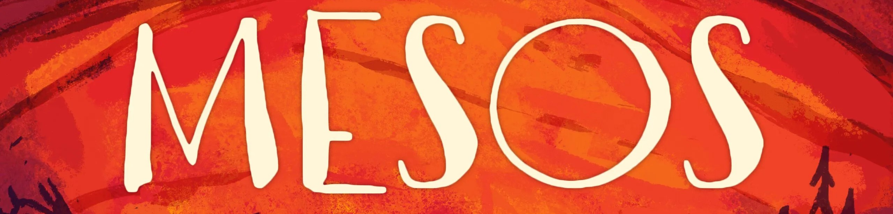
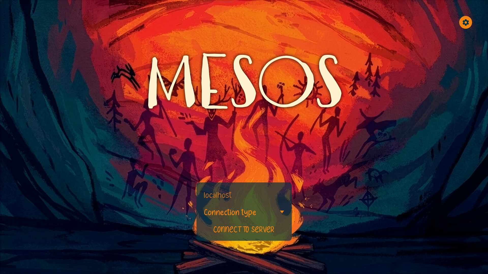
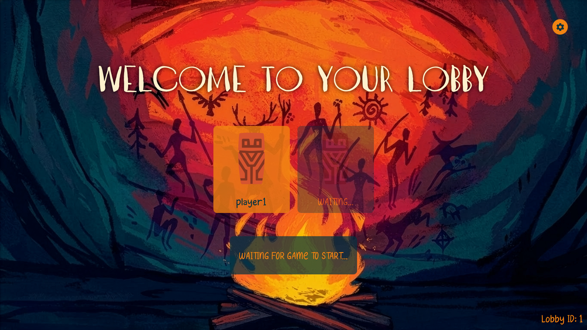
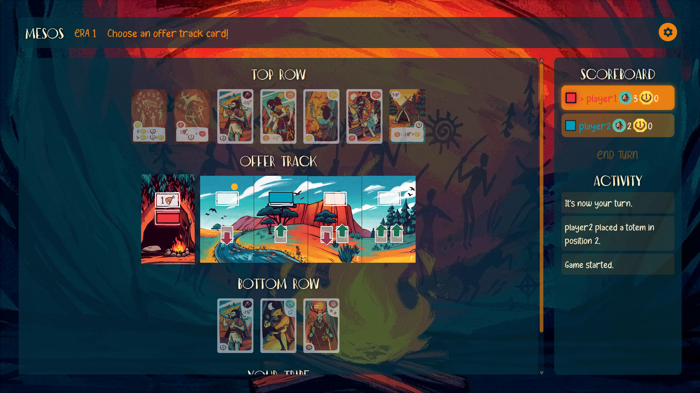
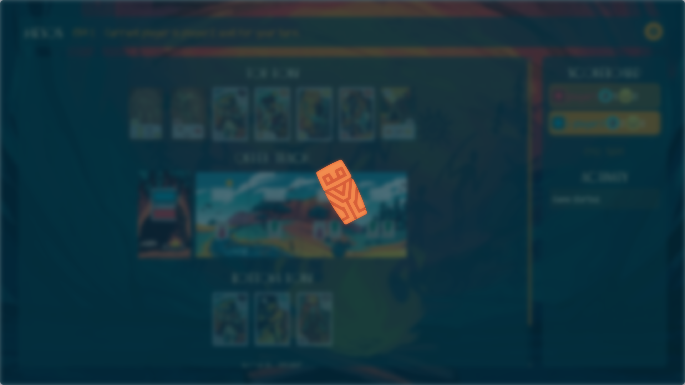
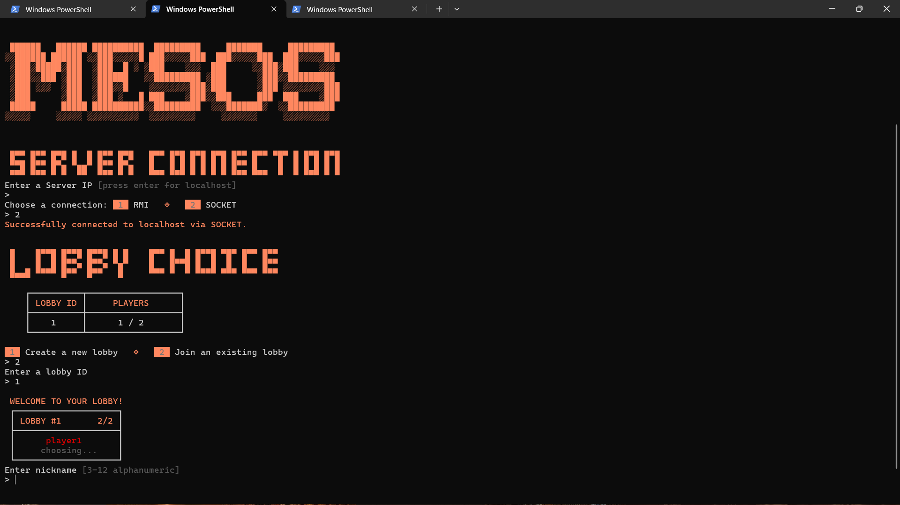
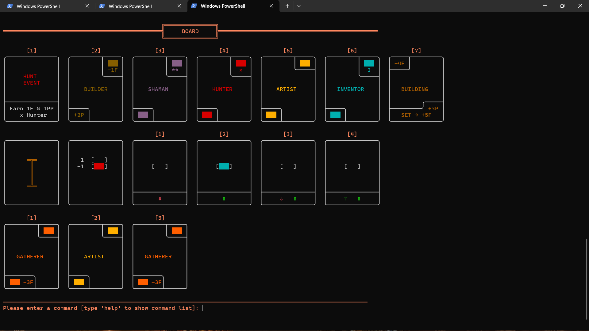

<a href="https://www.craniocreations.it/prodotto/mesos">
    
</a>
<h1 align="center">Software Engineering Final Project</h1>
<h3 align="center">085923 - PROVA FINALE (INGEGNERIA DEL SOFTWARE) A.A. 2025/2026</h3>
<p align="center">
    AM43 Group
</p>
<p align="center">
    <a href="https://github.com/peter-ss1">Pietro Cimino</a> •
    <a href="https://github.com/michelcostantini">Michel Costantini</a> •
    <a href="https://github.com/genna0506">Lorenzo Gennari</a> •
    <a href="https://github.com/paolooferrarii">Paolo Ferrari</a>
</p>

## Overview

The project implements the digital version of the <a href="https://www.craniocreations.it/prodotto/mesos"> Mesos </a> board game, produced by <a href="https://www.craniocreations.it/"> Cranio Creations </a>. It utilizes the MVC pattern, distributed over a client-server architecture. The implementation allows multiple concurrent matches and stores ranking data in an auxiliary database. Disconnections and crashes are handled both client- and server-side, improving user experience. The client application offers a Text-based User Interface (TUI) as well as a Graphical User Interface (GUI).

## Implemented Features
The project follows the provided [Requirements](assets/requirements.pdf), implementing all four advanced features.


<table align="center" width="100%">
<tr>
<td valign="top" width="50%">
<center>

<h3 align="center">Base Features</h3>

| Feature | Status |
| :---: | :---: |
| Complete rules | ✔️ |
| Socket protocol | ✔️ |
| RMI protocol | ✔️ |
| TUI | ✔️ |
| GUI | ✔️ |

</center>
</td>
<td valign="top" width="50%">
<center>

<h3 align="center">Advanced Features</h3>

| Feature | Status |
| :---: | :---: |
| Database Ranking | ✔️ |
| Multiple Matches | ✔️ |
| Disconnection Resilience | ✔️ |
| Server Persistence | ✔️ |

</center>
</td>
</tr>
</table>

## Documentation

The project documentation can be found in the `/deliverables` directory, which contains:

* **High-Level UML Diagrams**: Application architecture diagrams showing the general design.
* **Detailed UML Diagrams**: Complete diagrams showing all aspects of the application, generated directly from the source code.
* **Network Protocol Documentation**: Sequence diagrams showing the main processes of the communication protocol between the client and the server.
* **Javadoc Documentation**: Complete comment documentation.

### Used Tools

<td valign="top">
<center>

| Tool | Description |
| :---: | :---: |
| Maven | Project management and Java build automation |
| JavaFX | GUI framework |
| JUnit | Framework used for automated unit testing |
| Jackson | JSON parser for data serialization |
| HikariCP | JDBC connection pool for database management |
| MySQL | JDBC driver for MySQL database connectivity |

</center>
</td>


## User Manual

### 1. Initial Database Setup & Configuration

In order to correctly run the server application, you must set up the MySQL database to track game statistics and leaderboard rankings.

#### A. Create the Database and Schema

1. Open your MySQL terminal or database client (e.g., MySQL Workbench).
2. Execute the following SQL commands to create the database:

```sql
-- Create the game database
CREATE DATABASE IF NOT EXISTS mesos_db;
USE mesos_db;

-- Create the leaderboard table
CREATE TABLE IF NOT EXISTS Classifica (
    id SERIAL PRIMARY KEY,
    nickname VARCHAR(50) NOT NULL,
    punteggio INT NOT NULL,
    data_partita TIMESTAMP NOT NULL,
    num_giocatori INT NOT NULL
);

```

#### B. Configure Connection Settings

1. Locate the `src/main/resources/it/polimi/ingsw/am43/config.json` file in the project's root directory.
2. Open it in a text editor and update the password field with your private database credentials:

```json
"database": {
    "url": "jdbc:mysql://localhost:3306/mesos_db",
    "user": "root",
    "password": "password"
}

```

3. Save and close the file.


### 2. Generating JARs via IntelliJ IDEA (Maven required)

1. Open the project in **IntelliJ IDEA**.
2. Open the **Maven Tool Window** located on the right-hand sidebar (or go to *View -> Tool Windows -> Maven*).
3. Expand your project lifecycle tree.
4. Double-click **`clean`** to clear any previous build artifacts.
5. Double-click **`package`** to compile the code and execute test suites.
6. Once the build finishes successfully, look into your project directory. You will find the generated `.jar` files (`server.jar` and `client.jar`) inside the newly created **`/target`** folder.

### 3. Running Application from Terminal

Once you are in your terminal, navigate to the directory where your `.jar` files are stored and run one of the following commands to execute the corresponding application. **Please note that Java 25 is required to run these files.**

```bash
java -jar server.jar
java -jar client.jar

```

Note: if you are planning to use the Text-based User Interface (TUI), make sure to zoom in or out as needed to visualize the proper layout. If you are on Windows, your terminal may not default to the correct encoding. For optimal graphical experience, run the following commands based on your terminal:

#### Windows PowerShell

Run this command inside your session before launching the JAR to force PowerShell to output Unicode characters correctly:

```powershell
[Console]::OutputEncoding = [System.Text.Encoding]::UTF8
java -jar client.jar

```

#### Windows Command Prompt (cmd)

Change the active code page to UTF-8 (`65001`) before executing the application:

```cmd
chcp 65001
java -jar client.jar

```

## Gallery

### GUI

<div align="center">
  <figure>
    
    <figcaption>Welcome Screen</figcaption>
  </figure>
    <br><br>
  <figure>
    
    <figcaption>Lobby Screen</figcaption>
  </figure>
    <br><br>
  <figure>
    
    <figcaption>Game Screen</figcaption>
  </figure>
    <br><br>
  <figure>
    
    <figcaption>Loading Screen</figcaption>
  </figure>
</div>

### TUI

<div align="center">
  <figure>
    
    <figcaption>Welcome and Lobby Selection</figcaption>
  </figure>
    <br><br>
  <figure>
    
    <figcaption>Game Screen</figcaption>
  </figure>
</div>
